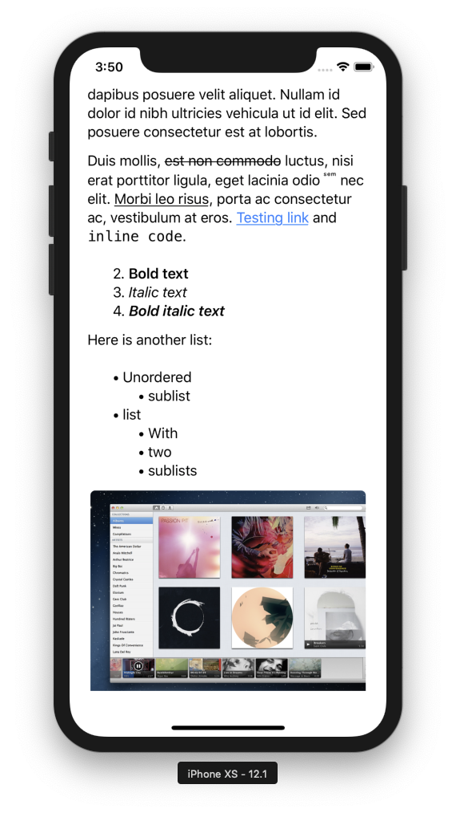

## CocoaMarkdown
#### Markdown parsing and rendering for iOS and macOS

CocoaMarkdown is a cross-platform framework for parsing and rendering Markdown, built on top of the [C reference implementation](https://github.com/jgm/CommonMark) of [CommonMark](http://commonmark.org).

### Why?

CocoaMarkdown aims to solve two primary problems better than existing libraries:

1. **More flexibility**. CocoaMarkdown allows you to define custom parsing hooks or even traverse the Markdown AST using the low-level API.
2. **Efficient `NSAttributedString` creation for easy rendering on iOS and macOS**. Most existing libraries just generate HTML from the Markdown, which is not a convenient representation to work with in native apps.




### Installation

First you will want to add this project as a submodule to your project:

```
git submodule add https://github.com/indragiek/CocoaMarkdown.git
```

Then, you need to pull down all of its dependencies.

```
cd CocoaMarkdown
git submodule update --init --recursive
```

Next, drag the `.xcodeproj` file from within `CocoaMarkdown` into your project. After that, click on the General tab of your target. Select the plus button under "Embedded Binaries" and select the CocoaMarkdown.framework.

### API

#### Traversing the Markdown AST

[`CMNode`](CocoaMarkdown/CMNode.h) and [`CMIterator`](CocoaMarkdown/CMIterator.h) wrap CommonMark's C types with an object-oriented interface for traversal of the Markdown AST.

```swift
let document = CMDocument(contentsOfFile: path, options: [])
document.rootNode.iterator().enumerateUsingBlock { (node, _, _) in
    print("String value: \(node.stringValue)")
}
```

#### Building Custom Renderers

The [`CMParser`](CocoaMarkdown/CMParser.h) class isn't _really_ a parser (it just traverses the AST), but it defines an `NSXMLParser`-style delegate API that provides handy callbacks for building your own renderers:

```objective-c
@protocol CMParserDelegate <NSObject>
@optional
- (void)parserDidStartDocument:(CMParser *)parser;
- (void)parserDidEndDocument:(CMParser *)parser;
...
- (void)parser:(CMParser *)parser foundText:(NSString *)text;
- (void)parserFoundHRule:(CMParser *)parser;
...
@end
```

[`CMAttributedStringRenderer`](CocoaMarkdown/CMAttributedStringRenderer.h) is an example of a custom renderer that is built using this API.

#### Rendering Attributed Strings

[`CMAttributedStringRenderer`](CocoaMarkdown/CMAttributedStringRenderer.h) is the high level API that will be useful to most apps. It creates an `NSAttributedString` directly from Markdown, skipping the step of converting it to HTML altogether.

Going from a Markdown document to rendering it on screen is as easy as:

```swift
let document = CMDocument(contentsOfFile: path, options: [])
let renderer = CMAttributedStringRenderer(document: document, attributes: CMTextAttributes())
textView.attributedText = renderer.render()
```

Or, using the convenience method on `CMDocument`:

```swift
textView.attributedText = CMDocument(contentsOfFile: path, options: []).attributedStringWithAttributes(CMTextAttributes())
```

HTML elements can be supported by implementing [`CMHTMLElementTransformer`](CocoaMarkdown/CMHTMLElementTransformer.h). The framework includes several transformers for commonly used tags:

* [`CMHTMLStrikethroughTransformer`](CocoaMarkdown/CMHTMLStrikethroughTransformer.h)
* [`CMHTMLSuperscriptTransformer`](CocoaMarkdown/CMHTMLSuperscriptTransformer.h)
* [`CMHTMLSubscriptTransformer`](CocoaMarkdown/CMHTMLSubscriptTransformer.h)

Transformers can be registered with the renderer to use them:

```swift
let document = CMDocument(contentsOfFile: path, options: [])
let renderer = CMAttributedStringRenderer(document: document, attributes: CMTextAttributes())
renderer.registerHTMLElementTransformer(CMHTMLStrikethroughTransformer())
renderer.registerHTMLElementTransformer(CMHTMLSuperscriptTransformer())
textView.attributedText = renderer.render()
```

#### Customizing Attributed strings rendering

All attributes used to style the text are customizable using the [`CMTextAttributes`](CocoaMarkdown/CMTextAttributes.h) class. 

Every Markdown element type can be customized using the corresponding `CMStyleAttributes` property in `CMTextAttributes`, defining 3 different kinds of attributes:

- String attributes, i.e. regular NSAttributedString attributes
- Font attributes, for easy font setting 
- Paragraph attributes, relevant only for block elements

Attributes for any Markdown element kind can be directly set:

```swift
let textAttributes = CMTextAttributes()
textAttributes.linkAttributes.stringAttributes[NSAttributedString.Key.backgroundColor] = UIColor.yellow
```

A probably better alternative for style customization is to use grouped attributes setting methods available in `CMTextAttributes`:

```swift
let textAttributes = CMTextAttributes()

// Set the text color for all headers
textAttributes.addStringAttributes([ .foregroundColor: UIColor(red: 0.0, green: 0.446, blue: 0.657, alpha: 1.0)], 
                                   forElementWithKinds: .anyHeader)

// Set a specific font + font-traits for all headers
let boldItalicTrait: UIFontDescriptor.SymbolicTraits = [.traitBold, .traitItalic]
textAttributes.addFontAttributes([ .family: "Avenir Next" ,
                                   .traits: [ UIFontDescriptor.TraitKey.symbolic: boldItalicTrait.rawValue]], 
                                 forElementWithKinds: .anyHeader)
// Set specific font traits for header1 and header2
textAttributes.setFontTraits([.weight: UIFont.Weight.heavy], 
                             forElementWithKinds: [.header1, .header2])

// Center block-quote paragraphs        
textAttributes.addParagraphStyleAttributes([ .alignment: NSTextAlignment.center.rawValue], 
                                           forElementWithKinds: .blockQuote)

// Set a background color for code elements        
textAttributes.addStringAttributes([ .backgroundColor: UIColor(white: 0.9, alpha: 0.5)], 
                                   forElementWithKinds: [.inlineCode, .codeBlock])
```

List styles can be customized using dedicated paragraph style attributes:

```swift
// Customize the list bullets
textAttributes.addParagraphStyleAttributes([ .listItemBulletString: "🍏" ], 
                                           forElementWithKinds: .unorderedList)
textAttributes.addParagraphStyleAttributes([ .listItemBulletString: "🌼" ], 
                                           forElementWithKinds: .unorderedSublist)

// Customize numbered list item labels format and distance between label and paragraph
textAttributes.addParagraphStyleAttributes([ .listItemNumberFormat: "(%02ld)", 
                                             .listItemLabelIndent: 30 ],    
                                           forElementWithKinds: .orderedList)

```

Font and paragraph attributes are incremental, meaning that they allow to modify only specific aspects of the default rendering styles.

Additionally on iOS, Markdown elements styled using the font attributes API get automatic Dynamic-Type compliance in the generated attributed string, just like default rendering styles.

### Rendering HTML

[`CMHTMLRenderer`](CocoaMarkdown/CMHTMLRenderer.h) provides the ability to render HTML from Markdown:

```swift
let document = CMDocument(contentsOfFile: path, options: [])
let renderer = CMHTMLRenderer(document: document)
let HTML = renderer.render()
```

Or, using the convenience method on `CMDocument`:

```swift
let HTML = CMDocument(contentsOfFile: path).HTMLString()
```

### Example Apps

The project includes example apps for iOS and macOS to demonstrate rendering attributed strings.

### Contact

* Indragie Karunaratne
* [@indragie](http://twitter.com/indragie)
* [http://indragie.com](http://indragie.com)

### License

CocoaMarkdown is licensed under the MIT License. See `LICENSE` for more information.